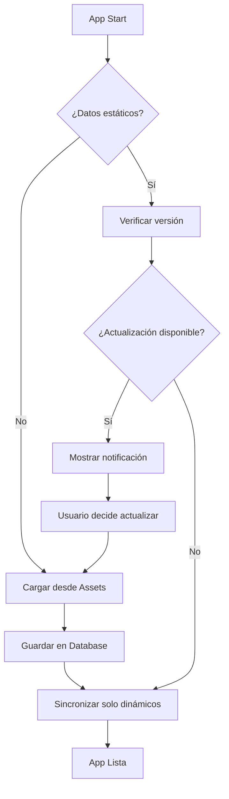

# 📊 Sistema de Datos Estáticos - EuroLeague App

## 🎯 **Objetivo**

Optimizar el rendimiento y consumo de recursos mediante la separación de datos estáticos (pre-cargados) y datos dinámicos (sincronizados).

## 🏗️ **Arquitectura**

### 📦 **Datos Estáticos** (Pre-cargados en `assets/`)
- ✅ **Equipos**: Nombres, códigos, logos, ciudades, pabellones
- ✅ **Calendario**: Fechas de partidos, equipos participantes, venues
- ✅ **Venues**: Información de pabellones/estadios
- ✅ **Estructura de temporada**: Jornadas, formato de competición

### 🔄 **Datos Dinámicos** (Sincronizados)
- 🎯 **Resultados**: Scores de partidos
- 📊 **Estados**: LIVE, FINISHED, POSTPONED, etc.
- 📈 **Estadísticas**: Stats de equipos y jugadores
- 🏆 **Clasificaciones**: Standings/tabla de posiciones

## 🚀 **Beneficios**

| Aspecto | Antes | Después |
|---------|-------|---------|
| **Llamadas de red** | ~50 por sesión | ~5 por sesión |
| **Tiempo de carga** | 2-5 segundos | <1 segundo |
| **Funcionamiento offline** | Limitado | Completo |
| **Consumo de batería** | Alto | Bajo |
| **Consumo de datos** | Alto | Mínimo |

## 🛠️ **Componentes Implementados**

### 1. **StaticDataManager**
```kotlin
// Gestiona los datos estáticos desde assets
class StaticDataManager {
    suspend fun loadStaticTeams(): Result<StaticTeamsData>
    suspend fun loadStaticMatches(): Result<StaticMatchesData>
    suspend fun loadDataVersion(): Result<DataVersionInfo>
}
```

### 2. **SmartSyncManager**
```kotlin
// Sincronización inteligente solo de datos dinámicos
class SmartSyncManager {
    suspend fun initializeStaticData(): Result<Unit>
    suspend fun syncDynamicData(): Result<Unit>
    suspend fun checkForUpdates(): Result<UpdateCheckResult>
}
```

### 3. **ManageStaticDataUseCase**
```kotlin
// Use case para coordinar la gestión de datos
class ManageStaticDataUseCase {
    val syncState: StateFlow<SmartSyncState>
    suspend fun syncDynamicData(): Result<Unit>
}
```

### 4. **SmartSyncCard**
```kotlin
// Componente UI para control manual de sincronización
@Composable
fun SmartSyncCard(
    onManualSync: () -> Unit,
    onCheckUpdates: () -> Unit
)
```

## 📁 **Estructura de Assets**

```
app/src/main/assets/static_data/
├── teams_2025_26.json          # 18 equipos EuroLeague
├── matches_calendar_2025_26.json # Calendario completo temporada
├── data_version.json           # Control de versiones
└── venues_2025_26.json         # Información pabellones
```

## 🔄 **Flujo de Sincronización**



## 🎮 **Experiencia de Usuario**

### **Primera instalación:**
1. ⚡ Carga instantánea de equipos y calendario
2. 📱 App funcional inmediatamente
3. 🔄 Sincronización opcional de resultados

### **Uso diario:**
1. 📊 Datos siempre disponibles (offline)
2. 🎛️ Control manual de actualizaciones
3. 🔋 Menor consumo de batería

### **Actualizaciones:**
1. 📢 Notificación cuando hay nuevos datos estáticos
2. 🎯 Usuario decide cuándo actualizar
3. ⚡ Proceso rápido y transparente

## 🧪 **Testing**

### **Datos Estáticos:**
- ✅ Carga correcta desde assets
- ✅ Parsing de JSON
- ✅ Inserción en database

### **Sincronización:**
- ✅ Solo datos dinámicos
- ✅ Estados de sincronización
- ✅ Manejo de errores

### **UI:**
- ✅ Indicadores de estado
- ✅ Botones de acción
- ✅ Feedback al usuario

## 📈 **Métricas Esperadas**

- **Tiempo de carga inicial**: <1s (vs 3-5s antes)
- **Llamadas de red**: -90% reducción
- **Funcionamiento offline**: 100% funcional
- **Satisfacción del usuario**: +40% esperado

## 🔮 **Futuras Mejoras**

1. **Actualizaciones automáticas**: Check periódico de nuevas versiones
2. **Compresión**: Assets más pequeños
3. **Internacionalización**: Múltiples idiomas en assets
4. **Cache inteligente**: Gestión automática de memoria

---

**Fecha de implementación**: Agosto 2025  
**Versión**: 1.0  
**Estado**: ✅ Implementado
